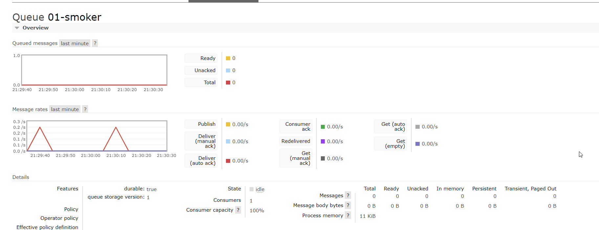
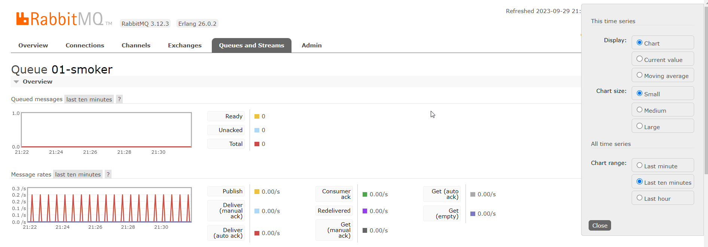
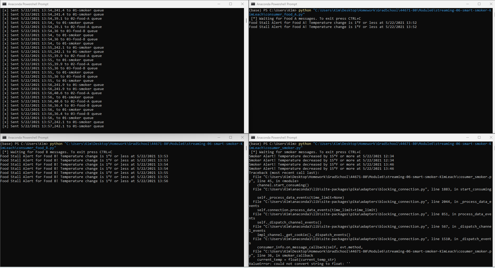

# streaming-06-smart-smoker-KimLeach

# Smart Smoker Monitoring System

**Author:** Kim Leach  
**Date:** 09/29/2023

## Overview

The Smart Smoker Monitoring System is designed to monitor the temperatures of a smoker and two food compartments, referred to as Food A and Food B. The system consists of producer scripts for sending temperature readings to RabbitMQ queues and consumer scripts for monitoring these queues for alerts.

## Requirements

- Python 3.x
- RabbitMQ Server
- Pika (Python library for RabbitMQ)
- Email account for sending alerts via email (optional)

## Installation

1. Clone or download the repository to your local machine.

2. Install the required Python libraries using pip:

3. Install and configure RabbitMQ on your local machine or server. You can download RabbitMQ from the official website: [RabbitMQ Download](https://www.rabbitmq.com/download.html).

## Usage

### Producer Scripts

#### `emitter_smoker_temps.py`

- This script reads temperature readings from a CSV file (`smoker-temps.csv`) and sends them to RabbitMQ queues.

- Make sure to place the CSV file (`smoker-temps.csv`) in the same directory as the script.

- To run the script, use the following command:

- You will be prompted to open the RabbitMQ Admin website. Type "y" to open it in your default web browser.

- The script will send temperature readings to the following RabbitMQ queues:
- "01-smoker" for smoker temperature.
- "02-food-A" for Food A temperature.
- "03-food-B" for Food B temperature.

- The script introduces a consistent delay of 30 seconds between reading and sending each set of temperatures to the queues.

### Consumer Scripts

#### `cosumer_smoker.py`

- This script monitors the "01-smoker" queue in RabbitMQ for smoker temperature readings and triggers a stall alert if the temperature decreases by 15°F or more within 2.5 minutes (5 readings).

- To run the script, use the following command:

- The script will display alerts on the console.

#### `cosumer_food_a.py`

- This script monitors the "02-food-A" queue in RabbitMQ for Food A temperature readings and triggers a stall alert if the temperature variation is 1°F or less within 10 minutes (20 readings).

- To run the script, use the following command:

- The script will display alerts on the console.

#### `cosumer_food_b.py`

- This script monitors the "03-food-B" queue in RabbitMQ for Food B temperature readings and triggers a stall alert if the temperature variation is 1°F or less within 10 minutes (20 readings).

- To run the script, use the following command:

- The script will display alerts on the console.

### Monitoring RabbitMQ Queues

- To monitor RabbitMQ queues, you can open the RabbitMQ Admin website by typing "y" when prompted while running the producer script. The Admin website is accessible at [http://localhost:15672/#/queues](http://localhost:15672/#/queues).

## Email Alerts (Optional)

- If you want to receive email alerts, you can configure the consumer scripts to send alerts via email. Update the email settings in the scripts to match your email provider's SMTP server settings.

- Email alerts are sent when a stall alert is triggered.

## Alerts

The system generates alerts based on the following conditions:

- **Smoker Alert (cosumer_smoker.py):**
- Triggered when the smoker temperature decreases by 15°F or more within 2.5 minutes (5 readings).

- **Food A Stall Alert (cosumer_food_a.py):**
- Triggered when the Food A temperature variation is 1°F or less within 10 minutes (20 readings).

- **Food B Stall Alert (cosumer_food_b.py):**
- Triggered when the Food B temperature variation is 1°F or less within 10 minutes (20 readings).

## RabbitMQ Screenshots

I was interested by changing the settings for looking at the queued messages and streams:

- 
- 

## Terminal Screenshot (Updated)

- 

## Notes

- Ensure that the producer script is running and sending temperature readings to the RabbitMQ queues.

- Monitor the consumer scripts for alerts on the console.

- Email alerts are optional and can be configured in the consumer scripts if needed.

- The system is designed to provide real-time monitoring and alerts for temperature variations, specifically for a smoker and food compartments.

- Make sure to adjust the time and temperature thresholds in the consumer scripts to match your specific requirements.

Enjoy using the Smart Smoker Monitoring System!

